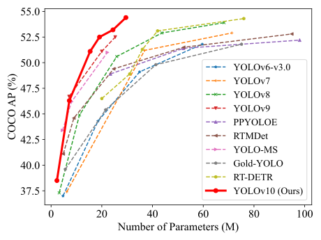

# [YOLOv10 C++ TensorRT: Real-Time End-to-End Object Detection](https://arxiv.org/abs/2405.14458)


TensorRT implementation of **YOLOv10**.
YOLOv10, built on the Ultralytics Python package by researchers at Tsinghua University, introduces a new approach to real-time object detection, addressing both the post-processing and model architecture deficiencies found in previous YOLO versions. By eliminating non-maximum suppression (NMS) and optimizing various model components, YOLOv10 achieves state-of-the-art performance with significantly reduced computational overhead. Extensive experiments demonstrate its superior accuracy-latency trade-offs across multiple model scales.


<p align="center">
  
   <br>
  Comparisons with others in terms of latency-accuracy (left) and size-accuracy (right) trade-offs.
</p>


<details>
  <summary>
  <font size="+1">Abstract</font>
  </summary>
Over the past years, YOLOs have emerged as the predominant paradigm in the field of real-time object detection owing to their effective balance between computational cost and detection performance. Researchers have explored the architectural designs, optimization objectives, data augmentation strategies, and others for YOLOs, achieving notable progress. However, the reliance on the non-maximum suppression (NMS) for post-processing hampers the end-to-end deployment of YOLOs and adversely impacts the inference latency. Besides, the design of various components in YOLOs lacks the comprehensive and thorough inspection, resulting in noticeable computational redundancy and limiting the model's capability. It renders the suboptimal efficiency, along with considerable potential for performance improvements. In this work, we aim to further advance the performance-efficiency boundary of YOLOs from both the post-processing and the model architecture. To this end, we first present the consistent dual assignments for NMS-free training of YOLOs, which brings the competitive performance and low inference latency simultaneously. Moreover, we introduce the holistic efficiency-accuracy driven model design strategy for YOLOs. We comprehensively optimize various components of YOLOs from both the efficiency and accuracy perspectives, which greatly reduces the computational overhead and enhances the capability. The outcome of our effort is a new generation of YOLO series for real-time end-to-end object detection, dubbed YOLOv10. Extensive experiments show that YOLOv10 achieves the state-of-the-art performance and efficiency across various model scales. For example, our YOLOv10-S is 1.8$\times$ faster than RT-DETR-R18 under the similar AP on COCO, meanwhile enjoying 2.8$\times$ smaller number of parameters and FLOPs. Compared with YOLOv9-C, YOLOv10-B has 46\% less latency and 25\% fewer parameters for the same performance.
</details>

**UPDATES** 🔥
Compared to other state-of-the-art detectors:

YOLOv10-S / X are 1.8× / 1.3× faster than RT-DETR-R18 / R101 with similar accuracy
YOLOv10-B has 25% fewer parameters and 46% lower latency than YOLOv9-C at same accuracy
YOLOv10-L / X outperform YOLOv8-L / X by 0.3 AP / 0.5 AP with 1.8× / 2.3× fewer parameters
Here is a detailed comparison of YOLOv10 variants with other state-of-the-art models:

Certainly! Here is the formatted text for your GitHub README file:

---

## Model Comparison

Here is a detailed comparison of YOLOv10 variants with other state-of-the-art models:

| Model         | Params (M) | FLOPs (G) | APval (%) | Latency (ms) | Latency (Forward) (ms) |
|---------------|------------|-----------|-----------|--------------|-----------------------|
| YOLOv6-3.0-N  | 4.7        | 11.4      | 37.0      | 2.69         | 1.76                  |
| Gold-YOLO-N   | 5.6        | 12.1      | 39.6      | 2.92         | 1.82                  |
| YOLOv8-N      | 3.2        | 8.7       | 37.3      | 6.16         | 1.77                  |
| YOLOv10-N     | 2.3        | 6.7       | 39.5      | 1.84         | 1.79                  |
| YOLOv6-3.0-S  | 18.5       | 45.3      | 44.3      | 3.42         | 2.35                  |
| Gold-YOLO-S   | 21.5       | 46.0      | 45.4      | 3.82         | 2.73                  |
| YOLOv8-S      | 11.2       | 28.6      | 44.9      | 7.07         | 2.33                  |
| YOLOv10-S     | 7.2        | 21.6      | 46.8      | 2.49         | 2.39                  |
| RT-DETR-R18   | 20.0       | 60.0      | 46.5      | 4.58         | 4.49                  |
| YOLOv6-3.0-M  | 34.9       | 85.8      | 49.1      | 5.63         | 4.56                  |
| Gold-YOLO-M   | 41.3       | 87.5      | 49.8      | 6.38         | 5.45                  |
| YOLOv8-M      | 25.9       | 78.9      | 50.6      | 9.50         | 5.09                  |
| YOLOv10-M     | 15.4       | 59.1      | 51.3      | 4.74         | 4.63                  |
| YOLOv6-3.0-L  | 59.6       | 150.7     | 51.8      | 9.02         | 7.90                  |
| Gold-YOLO-L   | 75.1       | 151.7     | 51.8      | 10.65        | 9.78                  |
| YOLOv8-L      | 43.7       | 165.2     | 52.9      | 12.39        | 8.06                  |
| RT-DETR-R50   | 42.0       | 136.0     | 53.1      | 9.20         | 9.07                  |
| YOLOv10-L     | 24.4       | 120.3     | 53.4      | 7.28         | 7.21                  |
| YOLOv8-X      | 68.2       | 257.8     | 53.9      | 16.86        | 12.83                 |
| RT-DETR-R101  | 76.0       | 259.0     | 54.3      | 13.71        | 13.58                 |
| YOLOv10-X     | 29.5       | 160.4     | 54.4      | 10.70        | 10.60                 |

---

You can copy and paste this Markdown table into your README file on GitHub.

## Performance
COCO
| Model | Test Size | #Params | FLOPs | AP<sup>val</sup> | Latency |
|:---------------|:----:|:---:|:--:|:--:|:--:|
| [YOLOv10-N](https://github.com/jameslahm/yolov10/releases/download/v1.0/yolov10n.pt) |   640  |     2.3M    |   6.7G   |     38.5%     | 1.84ms |
| [YOLOv10-S](https://github.com/jameslahm/yolov10/releases/download/v1.0/yolov10s.pt) |   640  |     7.2M    |   21.6G  |     46.3%     | 2.49ms |
| [YOLOv10-M](https://github.com/jameslahm/yolov10/releases/download/v1.0/yolov10m.pt) |   640  |     15.4M   |   59.1G  |     51.1%     | 4.74ms |
| [YOLOv10-B](https://github.com/jameslahm/yolov10/releases/download/v1.0/yolov10b.pt) |   640  |     19.1M   |  92.0G |     52.5%     | 5.74ms |
| [YOLOv10-L](https://github.com/jameslahm/yolov10/releases/download/v1.0/yolov10l.pt) |   640  |     24.4M   |  120.3G   |     53.2%     | 7.28ms |
| [YOLOv10-X](https://github.com/jameslahm/yolov10/releases/download/v1.0/yolov10x.pt) |   640  |     29.5M    |   160.4G   |     54.4%     | 10.70ms |

## Installation
`conda` virtual environment is recommended. 
```
conda create -n yolov10 python=3.9
conda activate yolov10
pip install -r requirements.txt
pip install -e .
```

## Validation
[`yolov10n.pt`](https://github.com/jameslahm/yolov10/releases/download/v1.0/yolov10n.pt)  [`yolov10s.pt`](https://github.com/jameslahm/yolov10/releases/download/v1.0/yolov10s.pt)  [`yolov10m.pt`](https://github.com/jameslahm/yolov10/releases/download/v1.0/yolov10m.pt)  [`yolov10b.pt`](https://github.com/jameslahm/yolov10/releases/download/v1.0/yolov10b.pt)  [`yolov10l.pt`](https://github.com/jameslahm/yolov10/releases/download/v1.0/yolov10l.pt)  [`yolov10x.pt`](https://github.com/jameslahm/yolov10/releases/download/v1.0/yolov10x.pt)  
```
yolo val model=yolov10n/s/m/b/l/x.pt data=coco.yaml batch=256
```

## Training 
```
yolo detect train data=coco.yaml model=yolov10n/s/m/b/l/x.yaml epochs=500 batch=256 imgsz=640 device=0,1,2,3,4,5,6,7
```

## Prediction
```
yolo predict model=yolov10n/s/m/b/l/x.pt
```

## Export
```
# End-to-End ONNX
yolo export model=yolov10n/s/m/b/l/x.pt format=onnx opset=13 simplify
# Predict with ONNX
yolo predict model=yolov10n/s/m/b/l/x.onnx

# End-to-End TensorRT
yolo export model=yolov10n/s/m/b/l/x.pt format=engine half=True simplify opset=13 workspace=16
# Or
trtexec --onnx=yolov10n/s/m/b/l/x.onnx --saveEngine=yolov10n/s/m/b/l/x.engine --fp16
# Predict with TensorRT
yolo predict model=yolov10n/s/m/b/l/x.engine
```


## Citation

If our code or models help your work, please cite our work!

